# PRPO projekt: EVCharging

Aplikacija za iskanje, rezerviranje in uporabo polnilnic za električne avtomobile.


## Navodila za uporabo

```shell
mvn clean package
docker-compose build
docker-compose up
```

Storitve:
- Keycloak (avtentikacija): `http://localhost:7999`
  - Login: `admin:password`
  - Uporabniki: `user1:password`, `owner1:password`, `admin1:password`, `microservice:password`
- Glavna storitev: `http://localhost:8080`
  - API: `/v1/<endpoint>`
  - OpenAPI UI: `/openapi`
  - OpenAPI spec: `/openapi/spec`
- Mikrostoritev "reports": `http://localhost:8081`
  - API: `/v1/reports`
- Mikrostoritev "invoices": `http://localhost:8082`
  - API: `/v1/invoices?user=<userId>&charge=<chargeId>`


## Podatkovni model



Koda za podatkovni model (Mermaid sintaksa): [class-diagram.md](res/class-diagram.md)


## Licenca

Avtorja projekta sta Ana Strmčnik in Erazem Kokot.
Projekt je licenciran z [MIT licenco](LICENSE).
