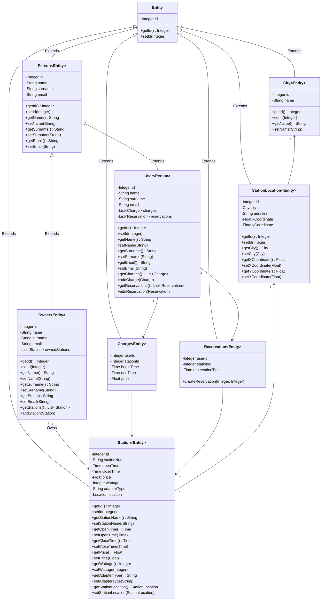

# PRPO projekt: EVCharging

Aplikacija za iskanje, rezerviranje in uporabo polnilnic za električne avtomobile.

## Podatkovni model

Koda za podatkovni model:

## Licenca

Avtorja projekta sta Ana Strmčnik in Erazem Kokot.
Projekt je licenciran z [MIT licenco](LICENSE).
