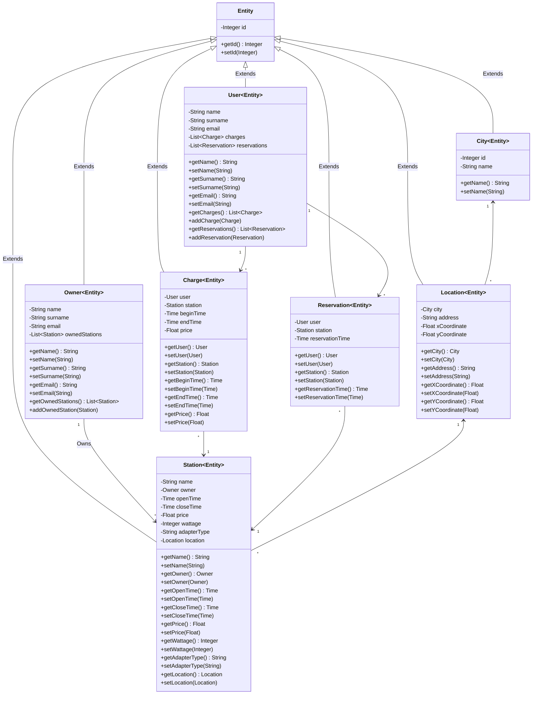

```mermaid
classDiagram

class Entity{
    -Integer id

    +getId() Integer
    +setId(Integer)
}

class User~Entity~{
    -String name
    -String surname
    -String email
    -List~Charge~ charges
    -List~Reservation~ reservations

    +getName() String
    +setName(String)
    +getSurname() String
    +setSurname(String)
    +getEmail() String
    +setEmail(String)
    +getCharges() List~Charge~
    +addCharge(Charge)
    +getReservations() List~Reservation~
    +addReservation(Reservation)
}

class Owner~Entity~{
    -String name
    -String surname
    -String email

    +getName() String
    +setName(String)
    +getSurname() String
    +setSurname(String)
    +getEmail() String
    +setEmail(String)
    -List~Station~ ownedStations
    +getOwnedStations() List~Station~
    +addOwnedStation(Station)
}

class Station~Entity~{
    -String name
    -Owner owner
    -Time openTime
    -Time closeTime
    -Float price
    -Integer wattage
    -String adapterType
    -Location location

    +getName() String
    +setName(String)
    +getOwner() Owner
    +setOwner(Owner)
    +getOpenTime() Time
    +setOpenTime(Time)
    +getCloseTime() Time
    +setCloseTime(Time)
    +getPrice() Float
    +setPrice(Float)
    +getWattage() Integer
    +setWattage(Integer)
    +getAdapterType() String
    +setAdapterType(String)
    +getLocation() Location
    +setLocation(Location)
}

class City~Entity~{
    -Integer id
    -String name

    +getName() String
    +setName(String)
}

class Location~Entity~{
    -City city
    -String address
    -Float xCoordinate
    -Float yCoordinate

    +getCity() City
    +setCity(City)
    +getAddress() String
    +setAddress(String)
    +getXCoordinate() Float
    +setXCoordinate(Float)
    +getYCoordinate() Float
    +setYCoordinate(Float)
}

class Charge~Entity~{
    -User user
    -Station station
    -Time beginTime
    -Time endTime
    -Float price

    +getUser() User
    +setUser(User)
    +getStation() Station
    +setStation(Station)
    +getBeginTime() Time
    +setBeginTime(Time)
    +getEndTime() Time
    +setEndTime(Time)
    +getPrice() Float
    +setPrice(Float)
}

class Reservation~Entity~{
    -User user
    -Station station
    -Time reservationTime

    +getUser() User
    +setUser(User)
    +getStation() Station
    +setStation(Station)
    +getReservationTime() Time
    +setReservationTime(Time)
}

Entity<|--User: Extends
Entity<|--Owner: Extends
Entity<|--Station : Extends
Entity<|--City : Extends
Entity<|--Location : Extends
Entity<|--Charge : Extends
Entity<|--Reservation : Extends
Owner "1" --> "*" Station: Owns
User "1" --> "*" Charge
Charge "*" --> "1" Station
User "1" --> "*" Reservation
Reservation "*" --> "1" Station
City "1" <-- "*" Location
Location "1" <-- "*" Station
```
